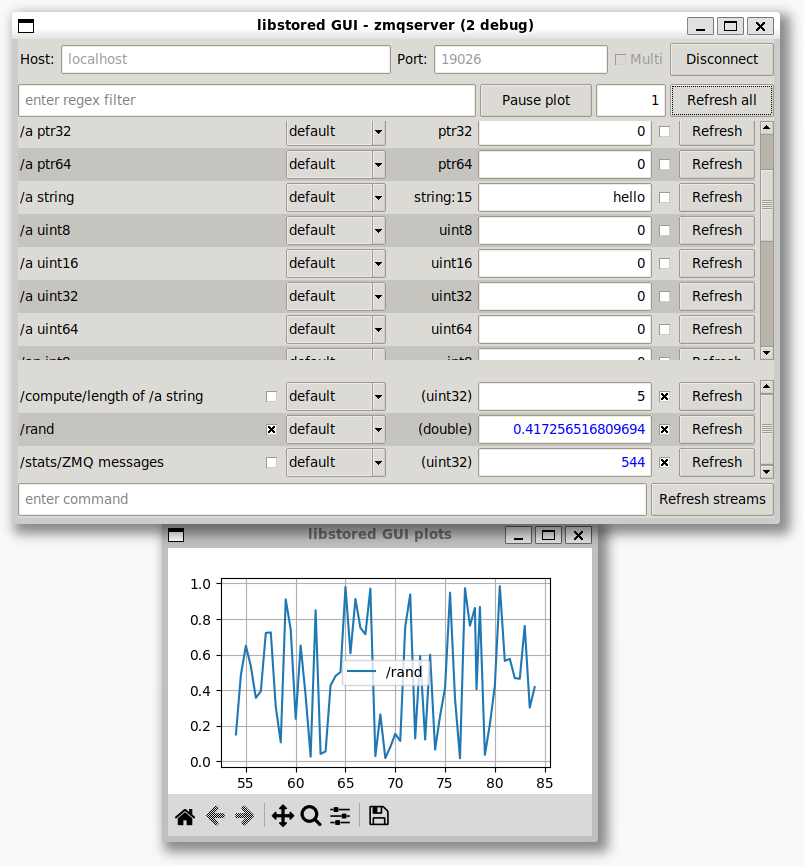



..
   SPDX-FileCopyrightText: 2020-2024 Jochem Rutgers
   
   SPDX-License-Identifier: CC-BY-4.0

.. image:: https://github.com/DEMCON/libstored/workflows/CI/badge.svg
   :alt: CI
   :target: https://github.com/DEMCON/libstored/actions?query=workflow%3ACI

libstored
=========

TL;DR
-----

What is it?
```````````

A generator for a C++ class (store) with your application's variables, and a
tool set to synchronize updates between processes (including FPGA), and debug
it remotely.  See also the presentation_.

When do I need it?
``````````````````

When you have a distributed application in need of synchronization, and/or you
want to be able to inspect and modify internal data of a running application.

Does it work on my platform?
````````````````````````````

Yes.

Huh? But how you do know my hardware architecture?
``````````````````````````````````````````````````

I don't. You have to supply the drivers for your (hardware) communication
interfaces, but everything else is ready to use.

Great! How do I use it?
```````````````````````
Have a look at the examples_.


Table of contents
-----------------

- `Introduction`_
- `libstored - Store by description`_
- `libstored - Store on a distributed system`_
- `libstored - Store for Embedded Debugger`_
   - `Example`_
   - `Embedded Debugger protocol`_
- `How to build`_
   - `How to integrate in your build`_
- `License`_


Introduction
------------

Data is at the core of any application. And data is tricky, especially when it
changes.  This library helps you managing data in three ways:

1. Using a simple language, you can define which variables, types, etc., you
   need. Next, a C++ class is generated, with these variables, but also with
   iterators, run-time name lookup, synchronization hooks, and more. This is
   your *store*. Additionally, a VHDL implementation is generated too, such
   that the store can also be used on an FPGA.
2. These stores can be synchronized between different instances via arbitrary
   communication channels.  So, you can build a distributed system over multiple
   processes or hardware nodes like microcontrollers and FPGAs, via lossy and
   lossless channels, over TCP, CAN, serial, you name it. When some node writes
   to its store, this update is distributed through your application.
3. The store can be accessed via a debugging protocol. Using this protocol, all
   objects in the store can be read/written or sampled at high frequency for nice
   plots. It offers streams to have a sort of stdout redirection or debugging
   output from your application. The protocol is ASCII based, and usable via
   PuTTY, for example.  However, there is GUI and CLI implementation available,
   which can be extended easily to build your custom (Qt) debugging GUI.

See next sections for details, but the following is worth to mention here:

- All code is normal C++, there are no platform-dependent constructs used.
  Therefore, all platforms are supported: Windows/Linux/Mac/bare
  metal (newlib), x86/ARM, gcc/clang/MSVC/armcc).
- The VHDL implementation is also generic, but only developed for Xilinx (using
  Vivado).
- The store and all other libstored classes are not thread-safe.
  Using threads is troubling anyway, use fibers_ instead.

Have a look in the examples_ directory for further in-depth reading.
Refer to the documentation_ for the C++ API.
See also the presentation_.


libstored - Store by description
--------------------------------

The store is described in a simple grammar.  See the examples_ directory for
more explanation. This is just an impression of the syntax:

.. code::

   // Comment
   // Grammar: type:size[array]=initializer long name with any character

   uint32 some int
   int8=42 another int, which is initialized
   (uint64) time (s)

   {
      bool=true b
      double[2] numbers
      string:16 s
   } scope

The generated store (C++ class) has variables that can be accessed like this:

.. code:: cpp

   mystore.some_int = 10;
   int i = mystore.another_int_which_is_initialized;
   mystore.time_s.get();
   mystore.scope__b = false;
   mystore.scope__numbers_0.set(0.1);
   mystore.scope__numbers_1.set(1.1);
   mystore.scope__s.set("hello");

The store has a few other interesting properties:

- Objects can have a piece of memory as backing (just like a normal variable in
  a ``struct``), but can also have custom callbacks on every get and set. This
  allows all kinds of side effects, even though the interface of the object is
  the same.
- Objects are accessible using a C++ interface, but also via name lookup by
  string. The generator generates a compact name parser, such that names,
  types, and sizes can be queried dynamically.
- A store is not thread-safe. This seems a limitation, but really, applications
  without threads are way easier to build and debug.


libstored - Store on a distributed system
-----------------------------------------

Synchronization is tricky to manage. libstored helps you by providing a
stored::Synchronizer class that manages connections to other Synchronizers.
Between these Synchronizers, one or more stores can be synchronized.  The (OSI)
Application layer is implemented, and several other (OSI) protocol layers are
provided to configure the channels as required. These protocols are generic and
also used by the debugger interface. See next section for details.

The store provides you with enough hooks to implement any distributed memory
architecture, but that is often way to complicated. The default Synchronizer is
simple and efficient, but has the following limitations:

- Only instances of the exact same store can be synchronized. This is checked
  using a SHA-1 hash over the .st file of the store. That is fine if you
  compile your program at once, but harder to manage if components are not
  built in the same compile run.
- Writes to a variable in a store should only be done by one process.  If
  multiple processes write to the same variable, the outcome of the
  synchronization is undefined. However, you would have a data race in your
  application anyway, so this is in practice probably not really a limitation.

See the documentation_ for more details.

The topology is arbitrary, as long as every store instance has one root, where
it gets its initial copy from. You could, for example, construct the following
topology::

   B--A--C
      |
   G--D--E--F
      |
      H

Assume that A is the first node, of all other nodes gets the initial copy from.
So, D registers at A, then E gets it from D, F from E, etc. After setup, any
node can write to the same store (but not to the same variable in that store).
So, updates from H are first pushed to D. The D pushes them to A, E and G, and
so on.

Different stores can have different topologies for synchronization, and
synchronization may happen at different speed or interval. Everything is
possible, and you can define it based on your application's needs.

The example `8_sync`_ implements an application with two
stores, which can be connected arbitrarily using command line arguments. You
can play with it to see the synchronization.

The store implementation in VHDL integrates a Synchronizer instance.  However,
it cannot be used as in intermediate node in the topology as described above;
the FPGA has to be a leaf.


libstored - Store for Embedded Debugger
---------------------------------------

If you have an embedded system, you probably want to debug it on-target.  One
of the questions you often have, is what is the value of internal variables of
the program, and how can I change them?  Debugging using ``gdb`` is great, but it
pauses the application, which also stops control loops, for example.

Using libstored, you can access and manipulate a running system.
The (OSI-stack) Application layer of this debugging interface is provided by
libstored. Additionally, other layers are available to support lossless and
lossy channels, which fit to common UART and CAN interfaces.  You have to
combine, and possibly add, and configure other (usually hardware-specific)
layers of the OSI stack to get the debugging protocol in and out of your
system.  Although the protocol fits nicely to ZeroMQ, a TCP stream, or ``stdio``
via terminal, the complexity of integrating this depends on your embedded
device.  However, once you implemented this data transport, you can access the
store, and observe and manipulate it using an Embedded Debugger (PC) client.
Moreover, the protocol supports arbitrary streams (like stdout) from the
application to the client, and has high-speed tracing of store variables. These
streams are optionally heatshrink_ compressed.  libstored provides Python
classes for your custom scripts, a CLI and GUI interface.

Your application can have one store with one debugging interface, but also
multiple stores with one debugging interface, or one store with multiple
debugging interfaces -- any combination is possible.

It seems to be a duplicate to have two synchronization protocols, but both have
a different purpose.  For synchronization, a binary protocol is used, which
only synchronizes data, using memory offsets, and some endianness.  This is
tightly coupled to the exact version and layout of the store. This is all known
at compile time, and great for performance, but harder to manage when you start
debugging. The debugging protocol is ASCII based, writable by hand, easy to use
dynamic lookup of variable names, and has support to easily add custom
commands by adding another capability in a subclass of stored::Debugger.

The FPGA does not support the debugging protocol. If you want to debug the
FPGA, instantiate the store, which includes a Synchronizer, and use a bridge in
C++ that has the same store, a Synchronizer connected to the FPGA, and a
Debugger instance. The connect to this C++ bridge.


Example
```````

The host tools to debug your application are written in Python, based on
PySide6. The ``libstored`` wheel file from the ``python`` directory is by
default installed in the venv, located in ``dist/venv``.

To get a grasp how debugging feels like, try the following.

1. Build the examples, as discussed above.
2. If you use Windows, execute ``dist\win32\env.cmd`` to set your environment
   properly.  In the instructions below, use ``python`` instead of ``python3``.
3. Run ``examples/zmqserver/zmqserver``. This starts an application with a
   store with all kinds of object, and provides a ZeroMQ server interface for
   debugging.
4. Activate the Python venv by running ``dist\venv\Scripts\activate.bat`` on
   Windows, or ``source dist/venv/bin/activate`` on Linux or macOS.
5. Run ``python3 -m libstored.gui``. This GUI connects to the ``zmqserver``
   application via ZeroMQ.
6. The GUI window will pop up and shows the objects of the ``zmqserver``
   example.  To add a signal to the plot, first enable the polling checkbox,
   and then enable the plot checkbox.

The structure of this setup is::

   +---------------+        +------------+
   | libstored.gui | -----> | matplotlib |
   +---------------+        +------------+
         |
         | ZeroMQ REQ/REP channel
         |
   +-----------+
   | zmqserver |
   +-----------+



The Embedded Debugger client connects via ZeroMQ.  If your application does not
have it, you must implement it somehow.  The ``examples/terminal/terminal``
application could be debugged as follows:

1. Run ``python3 -m libstored.wrapper.stdio build/deploy/bin/terminal`` from
   the activated venv (see above).  This starts the ``terminal`` example, and
   extracts escaped debugger frames from ``stdout``, which are forwarded to a
   ZeroMQ interface.
2. Connect a client, such as ``python3 -m libstored.gui``.  Instead of using
   ``matplotlib``, the GUI can also write all auto-refreshed data to a CSV file
   when the ``-f log.csv`` is passed on the command line. Then, Kst_ can be
   used for live viewing the file.

The structure of this setup is::

   +---------------+        +---------+           +-----+
   | libstored.gui | -----> | log.csv | --------> | Kst |
   +---------------+        +---------+           +-----+
         |
         | ZeroMQ REQ/REP channel
         |
   +-------------------------+
   | libstored.wrapper.stdio | ---------- terminal interface
   +-------------------------+
         |
         | stdin/stdout (mixed terminal interface
         | with Embedded Debugger messages)
         |
   +----------+
   | terminal |
   +----------+

There are some more ready-to-use clients, and a Python module in the python_
directory.


Embedded Debugger protocol
``````````````````````````

Communication with the debugger implementation in the application follows a
request-response pattern.  A full description of the commands can be found in
the documentation_.  These commands are implemented in the stored::Debugger
class and ready to be used in your application.

However, the request/response messages should be wrapped in a OSI-like protocol
stack, which is described in more detail in the documentation_ too.
This stack depends on your application. A few standard protocol layers are
available, which allow to build a stack for lossless channels (stdio/TCP/some
UART) and lossy channels (some UART/CAN). These stacks are configurable in
having auto retransmit on packet loss, CRC-8/16, segmentation, buffering, MTU
size, ASCII escaping and encapsulation. See also ``examples/7_protocol``.

To get a grasp about the protocol, I had a short chat with the ``zmqserver``
example using the ``libstored.cli``.  See the transcript below. Lines starting
with ``>`` are requests, entered by me, lines starting with ``<`` are responses
from the application.

In the example below, I used the following commands:

- ``?``: request capabilities of the target
- ``l``: list object in the store
- ``i``: return the identification of the target
- ``r``: read an object
- ``w``: write an object
- ``v``: request versions
- ``a``: define an alias

Refer to the documentation for the details about these and other commands.

::

   >  ?
   <  ?rwelamivRWst
   >  l
   <  0110/a blob
   201/a bool
   2b4/a float
   2f8/a double
   02f/a string
   312/a uint16
   334/a uint32
   301/a uint8
   378/a uint64
   234/a ptr32
   278/a ptr64
   392/an int16
   3b4/an int32
   381/an int8
   3f8/an int64
   7b4/compute/an int8 + an int16
   734/compute/length of /a string
   6f8/compute/circle area (r = /a double)
   734/stats/ZMQ messages
   734/stats/object writes
   778/t (us)
   6f8/rand

   >  i
   <  zmqserver
   >  r/a bool
   <  0
   >  w1/a bool
   <  !
   >  r/a bool
   <  1
   >  r/s/Z
   <  14
   >  r/s/Z
   <  15
   >  r/rand
   <  3d26000000000000
   >  r/rand
   <  3f50250b79ae8000
   >  r/rand
   <  3fa550a89cb27a00
   >  v
   <  2
   >  ar/rand
   <  !
   >  rr
   <  3fc69c39e2668200
   >  rr
   <  3fd755a4ab38afc0
   >  rr
   <  3fb7617168255e00


How to build
------------

Run ``dist/<platform>/bootstrap`` (as Administrator under Windows) once to
install all build dependencies.  Then run ``dist/<platform>/build`` to build
the project. This does effectively:

.. code:: bash

   mkdir build
   cd build
   cmake ../../.. -DCMAKE_INSTALL_PREFIX=deploy
   cmake --build .
   cmake --build . --target install

``dist/<platform>/build`` takes an optional argument, which allows you to
specify the ``CMAKE_BUILD_TYPE``.  If not specified, Debug is assumed.

By default, all examples are built.  For example, notice that sources are
generated under ``examples/1_hello``, while the example itself is built in the
``build`` directory. The documentation can be viewed at
``sphinx/html/index.html``.

To run all tests, use one of:

.. code:: bash

   cmake --build . --target test
   cmake --build . --target RUN_TESTS

Alternatively, use Visual Studio Code. Open the ``libstored`` repository in your
workspace, run the task ``bootstrap``, one of the ``config`` tasks, and one of
the ``build`` tasks afterwards. Run the ``test`` task to execute all tests.


How to integrate in your build
``````````````````````````````

Building libstored on itself is not too interesting, it is about how it can
generate stuff for you.  This is how to integrate it in your project:

1. Add libstored to your source repository, for example as a submodule.
2. Run ``dist/<platform>/bootstrap`` in the libstored directory once to install
   all dependencies.
3. Include libstored in your cmake project, such as:

   .. code:: cmake

      list(APPEND CMAKE_MODULE_PATH extern/libstored/cmake)
      include(libstored)

   Before including ``libstored``, you can specify several options (see
   ``cmake/libstored.cmake``), such as enabling ASan or clang-tidy.
   Especially the library dependencies (ZeroMQ, Zth, Qt, heatshrink) are
   relevant to consider.  For example, to enable ZeroMQ:

   .. code:: cmake

      list(APPEND CMAKE_MODULE_PATH extern/libstored/dist/common)
      find_package(ZeroMQ REQUIRED)
      set(LIBSTORED_HAVE_LIBZMQ ON)

   For Windows, Linux and macOS, the provided package in the ``common``
   directory tries to find ZeroMQ on your system, or it is built from source.
   For other targets, you might tweak this approach.

4. Optional: install ``dist/common/st.vim`` in ``$HOME/.vim/syntax`` to have
   proper syntax highlighting in vim.
5. Add some store definition file to your project, let's say ``MyStore.st``.
   Assume you have a target ``app`` (which can be any type of cmake target),
   which is going to use ``MyStore.st``, generate all required files. This will
   generate the sources in the ``libstored`` subdirectory of the current source
   directory, a library named ``app-libstored``, and set all the dependencies
   right:

   .. code:: cmake

      add_executable(app main.cpp)
      libstored_generate(TARGET app STORES MyStore.st)

6. To override the default configuration, provide a ``stored_config.h`` file.
   Add this to the build by either setting
   ``LIBSTORED_PREPEND_INCLUDE_DIRECTORIES`` to a space-separated list with
   application-specific include directories, containing the header file, or by
   setting the include directory using:

   .. code:: cmake

      target_include_directories(app-libstored BEFORE PUBLIC path/to/my/include)

7. Now, build your ``app``. The generated libstored library is automatically
   built.
8. If you want to use the VHDL store in your Vivado project, create a project
   for your FPGA, and source the generated file ``rtl/vivado.tcl``. This will
   add all relevant files to your project. Afterwards, just save the project as
   usually; the ``rtl/vivado.tcl`` file is not needed anymore.
9. If you ran the ``install`` target, a
   ``share/cmake/libstored/libstored.cmake`` file is generated.  If you
   include this file in another cmake project, you import all generated
   libraries as static libraries. See the ``examples/installed`` example how
   to do this.

Alternatively, you could install libstored from PyPI instead of the submodule
approach.  In that case:

1. Do something like ``python3 -m pip install libstored``.
2. Run ``python3 -m libstored.cmake`` to generate a ``FindLibstored.cmake``.
3. In your project, call ``find_package(Libstored)``, while having the
   generated ``FindLibstored.cmake`` in your ``CMAKE_MODULE_PATH``.

   ``Libstored`` accepts ``ZeroMQ``, ``Zth``, ``Heatshrink``, ``Qt5``, ``Qt6``
   as ``COMPONENTS``.  Setting these enables integration of these libraries
   with libstored. When possible, they are taken from your host system, or
   built from source (except Qt).  If you want more control over these
   libraries, you can also use the mechanism described above with manually
   setting ``LIBSTORED_HAVE_LIBZMQ`` and friends.
4. Continue with step 5 of the submodule-approach above.

Check out the examples of libstored, which are all independent applications
with their own generated store.

.. _Zth: https://github.com/jhrutgers/zth


License
-------

(Most of) this project is licensed under the terms of the Mozilla Public
License, v. 2.0, as specified in LICENSE. This project complies to `REUSE`_.


.. _presentation: https://demcon.github.io/libstored/libstored.sozi.html
.. _examples: https://github.com/DEMCON/libstored/tree/master/examples
.. _fibers: https://github.com/jhrutgers/zth
.. _documentation: https://demcon.github.io/libstored
.. _8_sync: https://github.com/DEMCON/libstored/tree/master/examples/8_sync
.. _heatshrink: https://github.com/atomicobject/heatshrink
.. _Kst: https://kst-plot.kde.org/
.. _python: https://github.com/DEMCON/libstored/tree/master/python
.. _REUSE: https://reuse.software/
